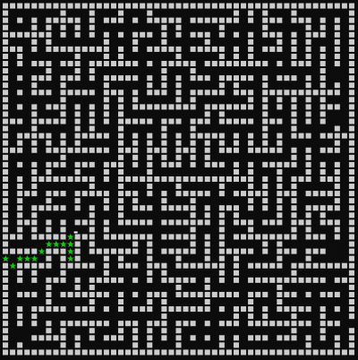

# Maze
Create a maze randomly. Search the created maze to see if you can escape.  
Input size of a maze and press any key. [Source code](code.c)  

# Play video
[Maze](Maze.mp4)

# Search process

# Result example
<b> Failure : incorrectly generated maze because of blocked wall </b>  
   
<b> Success : correctly generated maze </b>  
  
